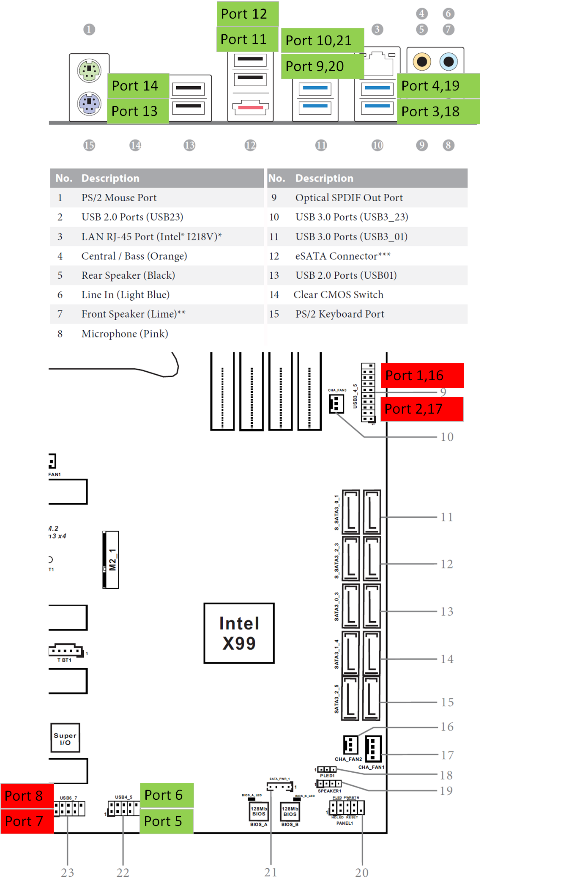

# OpenCore EFI for ASRock X99 Extreme4 + Broadwell-EP


## Current versions

- macOS Sonoma 14.5
- [OpenCore](https://github.com/acidanthera/OpenCorePkg) 1.0.0
- [OpenCore Legacy Patcher](https://github.com/dortania/OpenCore-Legacy-Patcher/) 1.5.0


## Hardware

- [ASRock X99 Extreme4  (Intel C610 Series X99 Chipset)](https://www.asrock.com/mb/Intel/X99%20Extreme4/index.asp#Overview)

- [Intel Xeon E5-2608L v4  (HEDT Broadwell-EP)](https://ark.intel.com/content/www/us/en/ark/products/92988/intel-xeon-processor-e5-2608l-v4-20m-cache-1-60-ghz.html)

- [AMD Sapphire PULSE Radeon RX 6600 8GB  (Navi 23)](https://www.techpowerup.com/gpu-specs/sapphire-pulse-rx-6600.b9270)
 or
- [AMD Sapphire PULSE Radeon RX 550 4GB  (Lexa)](https://www.techpowerup.com/gpu-specs/sapphire-pulse-rx-550-4-gb.b4472)
 or
- [nVidia HP NVS 510  (Kepler GK107)](https://www.techpowerup.com/gpu-specs/nvs-510.c1868)


## References

- [Dortania Guide Getting Started](https://dortania.github.io/getting-started/)

- [High End Desktop config for Broadwell-E](https://dortania.github.io/OpenCore-Install-Guide/config-HEDT/broadwell-e.html)

- [How to create SSDTs](https://dortania.github.io/Getting-Started-With-ACPI/ssdt-methods/ssdt-methods.html)

- [OpenCore Reference Manual](https://dortania.github.io/docs/latest/Configuration.html)


## Known Issue Workaround

When `Suspend to RAM = Auto` is set in BIOS, Sonoma requires a second keyboard press to power up the monitor.  
Sometimes, a keyboard press and power button press may be required to wake up.  
This keyboard wake issue matches [an issue in the Dortania guide](https://github.com/dortania/OpenCore-Post-Install/blob/master/usb/misc/keyboard.md),
but the method in the guide did not resolve it.  
If you cannot accept this issue, set `Suspend to RAM = Disabled` in the BIOS settings.  
So, when it goes into sleep, the monitor power is off just like before, but a second keyboard press is no longer needed.  
It doesn’t go into ACPI S3 sleep, so the CPU fan doesn’t stop, but it wakes up more quickly when waking up.  
Also, setting `Suspend to RAM = Disabled` can help prevent the 'Disk Not Ejected Properly' issue that may sometimes happen when waking up, even on a real Mac.


## BIOS Settings

	BIOS version:
		L3.81

	BIOS Settings:
		OC Tweaker -- CPU:​

			Intel SpeedStep Technology = Enabled
			Intel Turbo Boost Technology = Enabled

		Advanced -- CPU Configuration:

			Intel Virtualization Technology = Enabled

			CPU C States Support = Enabled​
				Package C State Support = C6(non Retention) state
				CPU C3 State Support = Enabled
				CPU C6 State Support = Enabled
				Enhanced Halt State(C1E) = Auto

		Advanced -- Chipset Configuration:
		​
			VT-d = Disabled

			Above 4G Decoding = Enabled  (if NVS 510, Disabled)
			SR-IOV Support = Disabled

			PCIE1 Link Speed = Gen3  (if NVS 510, Auto)

			PCI-E ASPM Support = Enabled
			PCH PCI-E ASPM Support = Enabled
			PCH DMI ASPM Support = Enabled

			Intel(R) Ethernet Connection I218-V = Enabled

			Onboard HD Audio = Enabled
			Deep Sleep = Disabled

			Good Night LED = Disabled

		Advanced -- Super IO Configuration:
		​
			Serial Port = Disabled
		​
		Advanced -- ACPI Configuration:

			Suspend to RAM = Auto  (see known issue workaround)

			PS/2 Keyboard Power On = Disabled
			Ring-In Power On = Disabled
			RTC Alarm Power On = By OS
			USB Keyboard/Remote Power On = Disabled
			USB Mouse Power On = Disabled
			PCIE Devices Power On = Disabled

		Advanced -- USB Configuration:

			USB Controller = Enabled
			Intel USB 3.0 Mode = Auto
			Legacy USB Support = Enabled
			Legacy USB 3.0 Support = Disabled
			USB Compatibility Patch = Disabled

		Advanced -- Trusted Computing:

			Security Device Support = Disabled​

		Boot:
		​
			CSM (Compatibility Support Module) = Disabled  (if NVS 510, Enabled)


## USB Port Mapping[^5]



- **Green** is active
- **Red** is inactive


## Pre-Installation

#### 1. USB stick with Sonoma 14.5
- Create a macOS install USB stick of 16GB or more[^2]

#### 2. USB stick with OpenCore 1.0.0
- Format a USB stick of 1GB or more in FAT32
- Copy the EFI folder from the repository to the USB stick
- Rename `EFI/OC/config.plist.xxxx` to `config.plist` , `xxxx` corresponds to your video board
- Copy the OpenCore-Patcher-GUI.app.zip to the USB stick[^3]
- Change the following values in `EFI/OC/config.plist`[^1]

```
PlatformInfo -> Generic -> SystemSerialNumber
PlatformInfo -> Generic -> MLB
PlatformInfo -> Generic -> SystemUUID
PlatformInfo -> Generic -> ROM
```


## Installation

1. Insert the USB stick with OpenCore 1.0.0 into the PC targeted for clean installation.
2. Insert the USB stick with Sonoma 14.5 into the same PC.
3. Boot from the USB stick with OpenCore 1.0.0.
4. Select `install macOS Sonoma` and install Sonoma 14.5.
5. Remove the USB stick with Sonoma 14.5 from the PC after installation.
6. (Option) Install `Post-install Root Patch` of OpenCore Legacy Patcher 1.5.0.
7. Copy the EFI folder from the USB stick with OpenCore 1.0.0 to the EFI System Partition of the Sonoma14.5 installed PC[^4].
8. Remove the USB stick with OpenCore 1.0.0 from the PC.


[^1]: Edit config.plist of EFI with [OpenCore Auxiliary Tools](https://github.com/ic005k/OCAuxiliaryTools) 20240001
[^2]: Create macOS install USB stick with [OpenCore Legacy Patcher](https://github.com/dortania/OpenCore-Legacy-Patcher/) 1.5.0 or [Making the installer in Windows](https://dortania.github.io/OpenCore-Install-Guide/installer-guide/windows-install.html)
[^3]: Re-activate support for NVS 510 with [OpenCore Legacy Patcher](https://github.com/dortania/OpenCore-Legacy-Patcher/) 1.5.0
[^4]: Mount EFI System Partition and open the mount point in Finder with [Hackintool](https://github.com/benbaker76/Hackintool) 4.9.3
[^5]: Map USB port with [USBToolBox](https://github.com/USBToolBox/tool) 1.1.1-RELEASE
